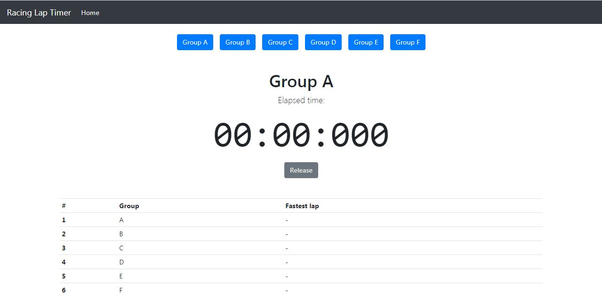

# Racing Lap Timer
A racing lap timer, based on a laser sensor.

- [Racing Lap Timer](#racing-lap-timer)
- [Motivation](#motivation)
- [Electronic](#electronic)
- [Software](#software)
  - [Preparation](#preparation)
  - [IDE](#ide)
  - [Installation](#installation)
  - [Build Project](#build-project)
  - [Update of the device](#update-of-the-device)
    - [Update via usb](#update-via-usb)
  - [Used Libraries](#used-libraries)
- [Issues, Ideas And Bugs](#issues-ideas-and-bugs)
- [License](#license)

# Motivation
For line follower competitions a racing lap timer shall be used. It doesn't only measure the lap time, it shows it nice via web interface, inclusive automatically result table generation.

# Electronic

* [Wemos D1 Mini (esp8266)](https://docs.platformio.org/en/latest/boards/espressif8266/d1_mini.html)
* [Waveshare laser sensor](www.waveshare.com/wiki/Laser_Sensor)

# Software

## Preparation
Install the serial driver for the Wemos D1 Mini board. Find the latest drivers here: https://www.wemos.cc/en/latest/ch340_driver.html

## IDE
The [PlatformIO IDE](https://platformio.org/platformio-ide) is used for the development. Its build on top of Microsoft Visual Studio Code.

## Installation
1. Install [VSCode](https://code.visualstudio.com/).
2. Install PlatformIO IDE according to this [HowTo](https://platformio.org/install/ide?install=vscode).
3. Close and start VSCode again.
4. Recommended is to take a look to the [quick-start guide](https://docs.platformio.org/en/latest/ide/vscode.html#quick-start).

## Build Project
1. Load workspace in VSCode.
2. Change to PlatformIO toolbar.
3. _Project Tasks -> Build_ or via hotkey ctrl-alt-b

## Update of the device

### Update via usb
1. Connect the Wemos D1 Mini board to your PC via USB.
2. Build and upload the software via _Project Tasks -> Upload_.
3. Build and upload the filesystem via _Project Tasks -> Upload File System image_.

## Used Libraries
* [Arduino](https://github.com/esp8266/Arduino) - ESP framework.
* [WifiManager](https://github.com/tzapu/WiFiManager) - ESP8266 WiFi Connection manager with fallback web configuration portal.
* [WebSockets](https://github.com/Links2004/arduinoWebSockets) - A WebSocket Server and Client for Arduino based on RFC6455.

# Issues, Ideas And Bugs
If you have further ideas or you found some bugs, great! Create a [issue](https://github.com/BlueAndi/RacingLapTimer/issues) or if you are able and willing to fix it by yourself, clone the repository and create a pull request.

# License
The whole source code is published under the [MIT license](http://choosealicense.com/licenses/mit/).
